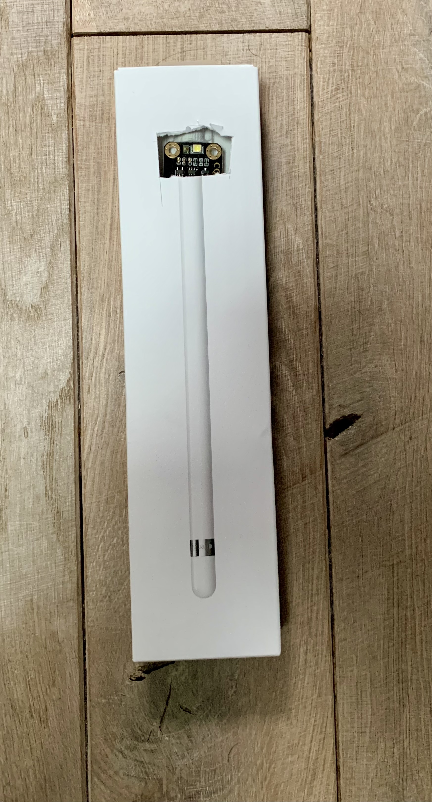
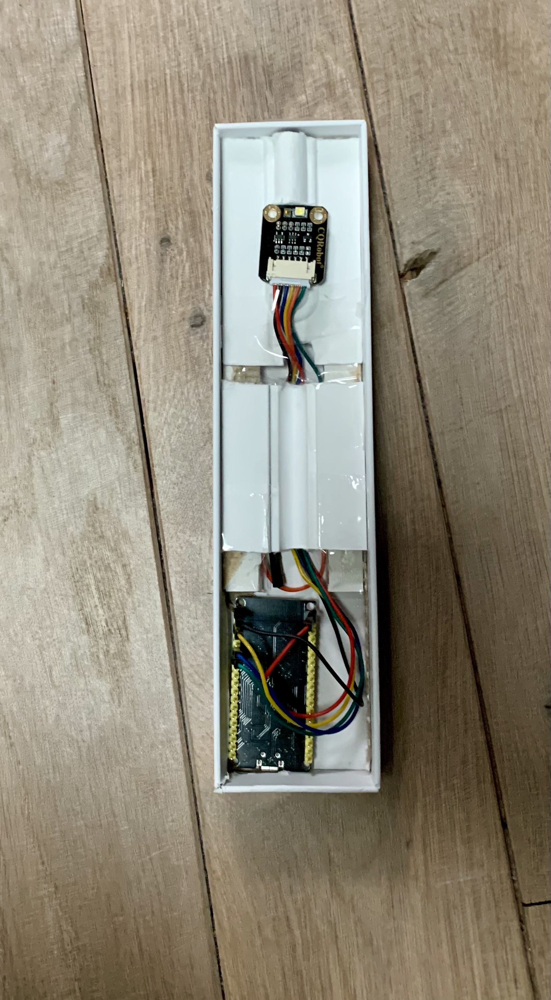

# Heater oil consumption metering system made with an ESP32 and TCS34725 sensor

This project is about monitoring the oil consumption of an oil heater. The heater uses a Weishaupt WL5 oil burner. The goal of the project is to build a non-invasive device that can monitor the oil consumption of the burner. We measure the runing time of the oil burner. Knowing the flow of the nozzle, we can then derive the oil consumption.
There are several ways to measure the running time of the burner. For this project, we rely on the status LED of the burner. When the burner is ON and heating, the status LED becomes green. We therefore use a TCS34735 to detect when the status led of the burner is green. This makes the measuring device completely independent of the burner and totally non-invasive.
We send the burner runing time to thingspeak API which then computes the oil consumption.

# How to build the project ?

You need an ESP32 and a TCS34725 color sensor.
To compile the code, you should add a "credentials.h" file inside the src folder with the following content :

```c
#define WIFI_SSID "Your WIFI SSID"
#define WIFI_PASSWD "Your WIFI password"
#define WRITE_API_KEY = "Your thingspeak read API key"
```

# Final build

Amazing Apple custom builded case...



